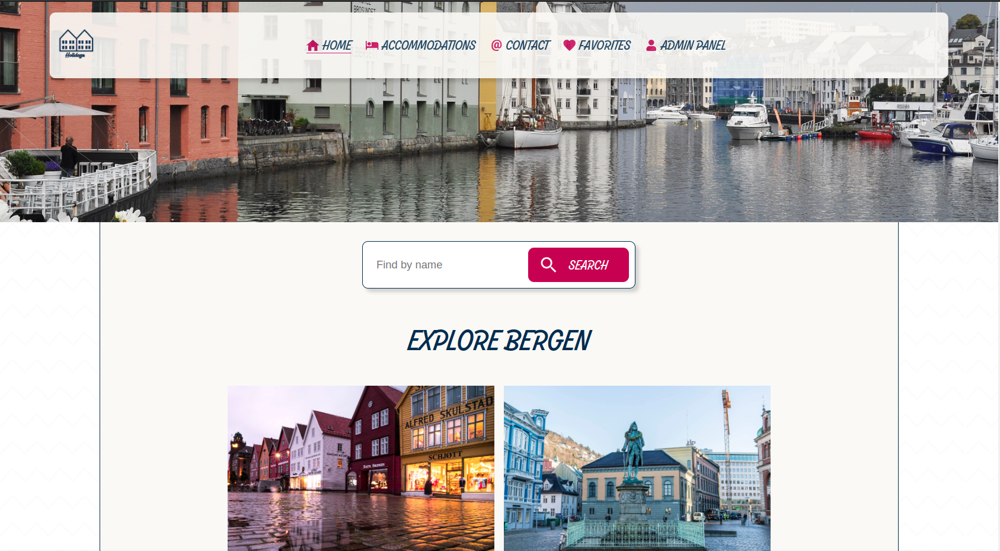

# Holidaze - Project 2



A simple project demonstrating Next.js

## Description

A website with Bergen's accommodations:

- Responsive
- Back-end with Strapi
- Back-end host at home server
- List/search/add products
- Send messages/enquiries
- Rating and Favorites
- Admin area

## Built With

- [HTML](https://developer.mozilla.org/en-US/docs/Web/HTML)
- [CSS](https://www.w3.org/Style/CSS/Overview.en.html)
- [JavaScript](https://www.javascript.com/)
- [Next.js](https://nextjs.org/)
- [strapi](https://strapi.io/)

## Getting Started

### Installing

1. Clone the repo:

```bash
git clone https://github.com/kronosGR/Next.js-Holidaze.git
```

2. Install the dependencies:

```
npm install
```

### Running

```bash
npm run dev
```

### Admin credentias

```
test@test.com
123456
```

## Contact

Contact me through the following links.

[My LinkedIn page](https://www.linkedin.com/in/kronosgr/)
